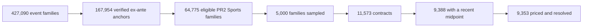
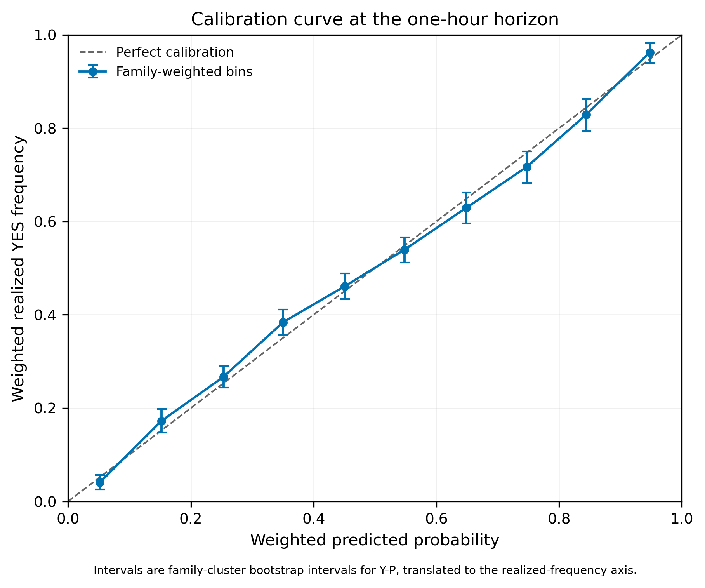
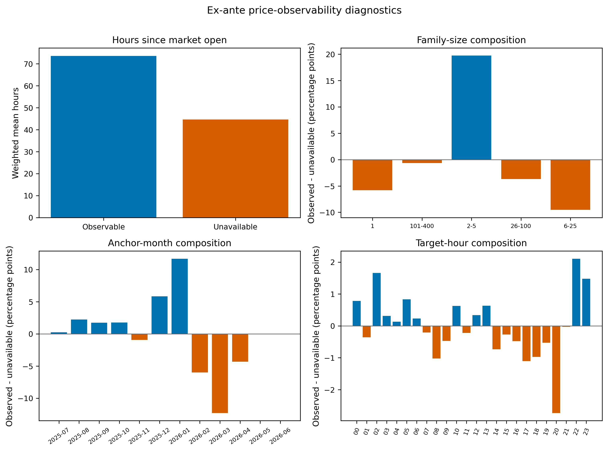

# Do Prediction Markets Overprice Longshots?

A contract that costs five cents can pay a dollar. That lottery-like payoff is
exactly why longshots are interesting—and why traders have long suspected that
people overpay for them.

I tested that idea on Kalshi. Starting from 427,090 event families, I built an
outcome-blind pipeline that identified event start times, sampled 11,573
contracts, reconstructed prices one hour before each event, and only then
released the outcomes.

The headline was not what I expected:

> **Among Sports markets with a recent two-sided quote, I found no clear
> evidence that longshots were more overpriced than favorites.**

That is not the same as saying the bias never exists. In fact, the most
interesting next question may be whether the bias is concentrated in the
quiet, thinly traded markets that were hardest to observe.

## The 60-second version

- The final analysis used **9,353 resolved contracts from 4,360 Sports event
  families**.
- Prices were measured **one hour before the event**, using a bid/ask midpoint
  no more than 15 minutes old.
- The longshot-minus-favorite calibration gap was **+1.00 percentage point**,
  with a 95% interval from **-2.36 to +4.57 points**.
- A classic favorite–longshot bias would produce a negative number. The
  estimate was small, positive, and statistically indistinguishable from zero.
- Five pre-planned checks—using older quotes, actual trade closes, and tighter
  spreads—gave the same qualitative answer.
- The conclusion is intentionally narrow: it applies to the observable Sports
  sample, not every Kalshi market.

## What does “longshot bias” mean?

Suppose a YES contract trades at $0.10. If it wins 10% of the time, the price
is well calibrated. If it wins only 6% of the time, buyers are paying ten cents
for something worth roughly six cents before fees—the kind of overpricing the
favorite–longshot hypothesis predicts.

I compared that pricing gap for contracts below $0.20 with the same gap for
contracts at or above $0.80. Under this definition, a negative
longshot-minus-favorite number points toward the classic bias.

## The hard part was deciding what “one hour before” means

Prediction-market records include settlement, close, and expiration times.
Those are convenient timestamps, but they can be recorded after the thing a
trader was trying to forecast. Using them would quietly leak future information
into the study.

So I separated the project into stages:



First I identified event times from information that existed before the event.
Then I froze the sample, prices, weights, and analysis plan. Outcomes stayed
quarantined until those decisions passed an audit. This made the result slower
to produce, but much harder to accidentally overfit.

## What the data said

| Result | Estimate | 95% family-cluster interval |
|---|---:|---:|
| Overall outcome-minus-price gap | +0.285 percentage points | [-0.333, +0.906] |
| Longshot-minus-favorite gap | +1.004 percentage points | [-2.358, +4.565] |

The chart below compares market prices with the fraction of contracts that
actually resolved YES. A perfectly calibrated market would sit on the diagonal.



No individual robustness choice changes the main story. Every interval in the
next chart crosses zero.


The honest reading is not “Kalshi is perfectly efficient.” It is: **this study
did not detect the classic bias in a pre-specified sample of observable Sports
markets.**

## Why start with the midpoint?

The midpoint between the best YES bid and ask is a useful estimate of the
market's probability. It is less dependent on one potentially stale trade and
lets us compare contracts on a common basis.

But it is not an executable price. A trader usually buys at the ask or sells at
the bid, pays fees, and may face limited size. That distinction matters. The
current result is a clean test of pricing calibration, not a claim that the
strategy could have earned the midpoint return.

The data already preserve the bid, ask, spread, most recent trade close, and
their timestamps. That makes an execution-aware follow-up possible without
changing the original result:

1. **Taker returns.** Price a YES purchase at the YES ask and the opposing
   position at its executable side, then subtract the applicable fees.
2. **Trade-based estimates.** Use the last observed trade only with an explicit
   age limit. A last trade is a real transaction, but it is not automatically
   the current “true price.”
3. **Market-making scenarios.** Estimate the edge available inside a spread,
   while reporting results under explicit fill assumptions. A displayed quote
   alone does not prove that a passive order would have filled or had queue
   priority.

Those analyses would answer a more directly tradable question: not merely
whether quoted probabilities were calibrated, but whether any apparent error
survived the spread, fees, staleness, and execution constraints.

## The missing markets may be the interesting markets

The primary sample excluded 928 contracts with no pre-target candle and 1,256
whose nearest valid midpoint was 15–60 minutes old. Price availability was not
random: observable and unavailable contracts differed by market age, family
size, and month.



That creates a plausible trading hypothesis:

> Heavily followed markets may be efficient because information and capital
> arrive quickly. Longshot bias may be easier to find in low-attention markets
> with fewer trades, wider spreads, or stale quotes.

The current study does **not** establish that hypothesis. “Missing a recent
quote” can reflect several things besides low attention, and selecting markets
after seeing their outcomes would create a new bias. A defensible follow-up
should define attention using information available before the target time—such
as prior trade count, volume, quote availability, spread, market age, and open
interest—and freeze those definitions before comparing outcomes.

## Why look beyond Sports?

Sports was the cleanest first test because event start times are observable and
repeatable. It may also be a tough place to find a simple edge: major games are
followed by experienced sportsbooks and many informed traders.

Politics, entertainment, economics, and other categories may have different
participants, information cycles, and liquidity. The next cross-category study
should therefore ask two separate questions:

- Does calibration differ by category after applying the same ex-ante timing
  rules?
- Does any difference remain after accounting for pre-event liquidity and
  realistic execution prices?

That extension would be exploratory and separately pre-specified. It would not
replace the frozen Sports result.

## Why this is a quant project, not just a chart

The statistical estimate is only the final layer. The larger exercise involved:

- building a resumable, partitioned acquisition system for millions of market
  records;
- detecting incomplete API collection and recovering omitted events;
- verifying event times without settlement leakage;
- designing a two-stage probability sample with exact inclusion weights;
- reconstructing historical quotes and trades without post-target data;
- preserving family-level dependence in the bootstrap; and
- making every published table and figure reproducible from hash-pinned inputs.

The result is less flashy than a profitable backtest, but it is more credible:
the analysis reports what the data support, surfaces the selection problem, and
turns the limitation into a testable next hypothesis.

## Read the technical work

- [Short technical summary](reports/phase_10g/MENTOR_EXECUTIVE_SUMMARY.md)
- [Full methods and results](reports/phase_10g/PAPER_REPORT.md)
- [Primary and robustness estimates](reports/phase_10g/table_2_primary_and_robustness.csv)
- [Calibration bins](reports/phase_10g/table_3_calibration_deciles.csv)
- [Missingness and observability diagnostics](reports/phase_10g/table_4_missingness_observability.csv)
- [Frozen pre-outcome analysis plan](PHASE_10F_FINAL_ANALYSIS_PLAN.md)
- [Reproducibility manifest](reports/phase_10g/reproducibility_manifest.json)

## Reproduce the published package

```bash
python -m venv .venv
source .venv/bin/activate
python -m pip install -r requirements.txt
python -m pytest -q
python -m scripts.pipeline_v2.build_phase_10g_paper_report \
  --code-commit 250b9d3f3f1117b7f421020c80b368f2eb02bf5e
```

The authoritative analysis identity is
`931a1d35de134e91eee3ed71041a712414c1435fbcd37f1ffc28b263e746252e`.
Large acquisition and contract-level artifacts remain ignored and local;
GitHub contains the compact aggregate tables, figures, code, tests, and hash
manifest. No credentials are stored in the repository.
