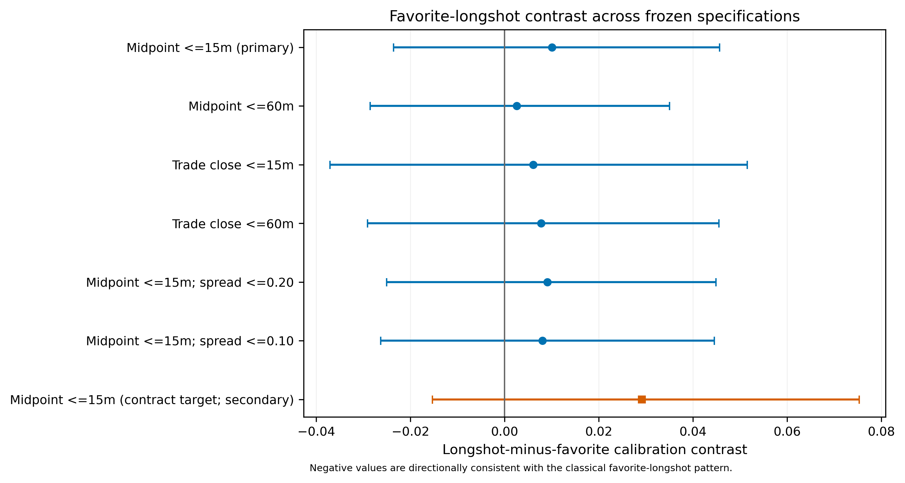

# Prediction Market Longshot Bias

This repository contains a leakage-resistant empirical study of
favorite–longshot bias in Kalshi prediction markets. The current analysis is
complete through deterministic paper-ready reporting.

> **Primary conclusion:** In the pre-specified PR2 Sports sample, we detect no
> statistically distinguishable evidence of favorite–longshot bias.

This conclusion is deliberately narrow. It applies to verified
scheduled-event-start Sports markets, the frozen probability sample, and
contracts with valid observable prices one hour before the event. It does not
show that Kalshi as a whole has no favorite–longshot bias, that the true effect
is exactly zero, or that markets are perfectly calibrated.

## Main result

The primary estimand gives equal target weight to market families and uses the
latest fully pre-event YES bid/ask midpoint within 15 minutes of the frozen
one-hour horizon.

| Quantity | Estimate | 95% family-cluster bootstrap interval |
|---|---:|---:|
| Weighted calibration gap, `Y-P` | 0.00285 | [-0.00333, 0.00906] |
| Longshot-minus-favorite contrast | 0.01004 | [-0.02358, 0.04565] |

The frozen contrast is
`mean(Y-P | P < 0.20) - mean(Y-P | P >= 0.80)`. A negative value is
directionally consistent with the classical favorite–longshot pattern. The
estimated contrast is small and positive, and its interval includes zero. All
five pre-specified robustness intervals also include zero.



## Study sample

The stages below describe different populations and should not be interpreted
as a single undifferentiated attrition sequence.

| Stage | Count |
|---|---:|
| Original Kalshi event-family universe | 427,090 families |
| Verified PR1-M or PR2-M anchors | 167,954 families |
| Verified anchors inside the frozen window | 161,343 families |
| Structurally eligible at the one-hour horizon | 112,166 families |
| Confirmatory PR2 Sports population | 64,775 families |
| Frozen probability sample | 5,000 families / 11,573 contracts |
| Primary price-observable sample | 9,388 contracts |
| Primary binary-resolved sample | 9,353 contracts / 4,360 families |

Binary outcomes were available for 11,495 sampled contracts; 78 were
unresolved or nonbinary and remained missing without replacement or adaptive
reweighting. Weighted resolution coverage was 99.21% for the family target and
99.46% for the contract target.

## Research design

The design separates event timing, prices, and outcomes to prevent look-ahead
bias:

1. **Ex-ante anchors.** Settlement, resolution, close, and expiration times are
   prohibited as research anchors. Candidate event times were constructed from
   outcome-blind metadata and audited before verification.
2. **Frozen timing rules.** PR1-M covers approved fixed-clock cases; PR2-M
   covers one official scheduled-event-start milestone. The confirmatory price
   analysis is PR2-M Sports only because historical PR1 midpoint coverage was
   too sparse.
3. **Frozen horizon and prices.** The target is one hour before the verified
   event time. The primary measure is a fully pre-target bid/ask midpoint with
   no more than 15 minutes of staleness. No post-target or previous-price
   fallback is allowed.
4. **Probability sampling.** Families were sampled within month × family-size
   strata, with at most three contracts per family. Exact inclusion
   probabilities support separate family- and contract-target weights.
5. **Outcome quarantine.** Outcomes were inaccessible until anchors, sample
   identities, prices, weights, exclusions, and the analysis plan were frozen
   and audited. Only a three-field binary-outcome projection was released.
6. **Family-aware inference.** The primary estimator is family-weighted.
   Uncertainty uses 10,000 deterministic stratified family-cluster bootstrap
   replicates.

The frozen analysis window is
`[2025-07-01T00:00:00Z, 2026-07-01T00:00:00Z)`. The `StudyRules` fingerprint is
`12d6955f57b50b5587fdadf02b2bc96e7de48d022c9ac3cc2fe0425d907b9901`.

## Paper-ready materials

The mentor-facing reporting package is in [`reports/phase_10g/`](reports/phase_10g/):

- [combined paper report](reports/phase_10g/PAPER_REPORT.md);
- [Methods](reports/phase_10g/METHODS.md),
  [Results](reports/phase_10g/RESULTS.md),
  [Discussion](reports/phase_10g/DISCUSSION.md), and
  [Limitations](reports/phase_10g/LIMITATIONS.md);
- [short mentor summary](reports/phase_10g/MENTOR_EXECUTIVE_SUMMARY.md);
- [sample construction](reports/phase_10g/table_1_sample_construction.csv),
  [primary and robustness estimates](reports/phase_10g/table_2_primary_and_robustness.csv),
  [calibration deciles](reports/phase_10g/table_3_calibration_deciles.csv), and
  [missingness diagnostics](reports/phase_10g/table_4_missingness_observability.csv);
- four figures in publication PNG and editable SVG formats; and
- the [reproducibility manifest](reports/phase_10g/reproducibility_manifest.json).

The calibration and observability figures are also available directly:

- [Figure 1: calibration curve](reports/phase_10g/figure_1_calibration_curve.png)
- [Figure 2: calibration gap by decile](reports/phase_10g/figure_2_decile_calibration_gap.png)
- [Figure 3: robustness forest plot](reports/phase_10g/figure_3_robustness_forest.png)
- [Figure 4: price-observability diagnostics](reports/phase_10g/figure_4_observability_diagnostics.png)

## Important limitations

- The confirmatory estimate covers PR2-M scheduled-event-start Sports markets,
  not every Kalshi category or timing structure.
- Inference is conditional on a valid pre-target price. Observability was not
  random, and no observation-propensity correction was used because its
  assumptions were not defensible.
- A bid/ask midpoint is indicative rather than necessarily executable.
- Contracts within one event family are dependent; the weighting and bootstrap
  preserve that family structure.
- The confidence interval including zero is not proof that the true effect is
  zero.
- One of ten descriptive calibration-bin intervals excludes zero, but it was
  not the primary contrast, the ten bins are reported jointly, and the profile
  does not show a monotonic favorite–longshot pattern.

See the full [Limitations section](reports/phase_10g/LIMITATIONS.md) for details.

## Reproducibility

Create a Python environment and run the offline test suite:

```bash
python -m venv .venv
source .venv/bin/activate
python -m pip install -r requirements.txt
python -m pytest -q
```

With the frozen local data artifacts present, regenerate or validate the
paper-ready package using:

```bash
python -m scripts.pipeline_v2.build_phase_10g_paper_report \
  --code-commit 250b9d3f3f1117b7f421020c80b368f2eb02bf5e
```

The reporting command verifies every frozen source hash and fails closed if an
input or existing output differs. The explicit commit argument preserves the
identity of the code that generated the immutable reporting package even after
later documentation-only commits. The authoritative Phase 10G analysis
identity is `931a1d35de134e91eee3ed71041a712414c1435fbcd37f1ffc28b263e746252e`.
The reporting manifest SHA-256 is
`db298df905de11e145638d1f633f6829b5a9006f8012f0c02755e5f38443ccc8`.

Large acquisition and contract-level analysis artifacts under
`data/pipeline_v2/` remain ignored and local; they are not committed to GitHub.
The repository does include the compact aggregate paper tables, figures, and
their complete hash manifest. No credentials are stored in the repository.

## Repository guide

- [`reports/phase_10g/`](reports/phase_10g/) — final paper-ready outputs
- [`scripts/pipeline_v2/`](scripts/pipeline_v2/) — current methodology-v2 code
- [`scripts/pipeline_v2/README.md`](scripts/pipeline_v2/README.md) — technical pipeline guide
- [`PHASE_10F_FINAL_ANALYSIS_PLAN.md`](PHASE_10F_FINAL_ANALYSIS_PLAN.md) — plan frozen before outcome access
- [`PROJECT_STATUS.md`](PROJECT_STATUS.md) — phase-by-phase project record
- [`DECISION_LOG.md`](DECISION_LOG.md) — methodological decisions and approvals
- [`DATA_RUNBOOK.md`](DATA_RUNBOOK.md) — reproducibility and safety procedures
- [`NEXT_ACTIONS.md`](NEXT_ACTIONS.md) — current editorial review gate
- [`scripts/legacy/`](scripts/legacy/) — superseded prototypes retained for provenance

## Current status

The empirical analysis and deterministic reporting package are complete. The
next step is mentor/editorial review and integration into the final paper. Any
new subgroup, model, horizon, price definition, or multiple-comparison
procedure would be a separately labeled exploratory extension and would not
replace the frozen confirmatory analysis.
