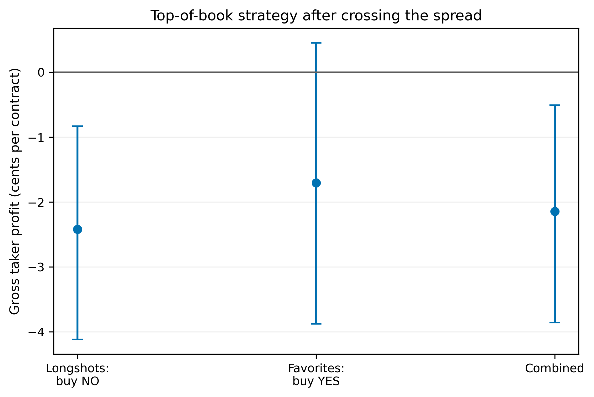
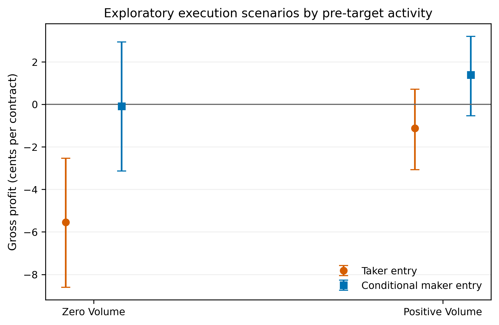

# Can the apparent pricing result survive the spread?

## Exploratory status

This is a post-confirmatory Phase 10I analysis. It was designed after the Phase
10G outcomes were known. It does not replace or modify the frozen conclusion
that the confirmatory Sports analysis detected no statistically distinguishable
favorite–longshot bias.

## Executable-price proxy

The applied strategy buys NO against midpoint longshots below $0.20 at
`1 - YES bid`, and buys YES favorites at or above $0.80 at the YES ask. It holds
one contract to resolution. These candle-close top-of-book prices incorporate
the observed spread, but not depth, latency, or additional slippage.

Under the family target, the combined gross taker profit is
**-2.15¢ per contract** (95% family-
cluster interval [-3.86¢, -0.51¢])
across 2,261 tail contracts and 1,384
families. Longshots contribute -2.42¢
per contract and favorites -1.70¢.

The published general-fee formula is shown as a scenario because exact
historical market-specific overrides and participant rebates are unavailable.
After the one-contract fee-rounding scenario, combined profit is
-3.15¢; under the 100-contract
fee-rounding scenario it is -2.73¢
per contract. The latter is not a claim that 100 contracts were displayed at
the best price.

## Was the result different in quiet markets?

Within the priced tail sample, zero reported volume in the pre-target hour has
gross taker profit of -5.54¢; positive-
volume markets have -1.12¢. Its zero-minus-positive-volume difference has a 95% interval of [-7.95¢, -0.88¢].
Conditional passive-entry profit is
-0.08¢ in zero-volume markets and
+1.39¢ in positive-volume markets.
 The zero-minus-positive-volume conditional-maker difference has a 95% interval of [-4.97¢, +2.07¢].

This comparison cannot identify returns for the 928 contracts with no
pre-target candle because they have no executable target-time price. It tests
the low-attention hypothesis only within the price-observable sample. Volume,
trade presence, open interest, spread, staleness, and market age are measured
before the target.

## Market-making scenarios

Passive-entry calculations use the displayed bid side and are conditional on a
complete fill. They do not model queue priority, fill probability, inventory,
adverse selection, latency, or capacity. Their apparent improvement over taker
entries partly reflects mechanical spread capture and must not be called
realized alpha. This warning is especially important for the zero-volume group:
the conditional maker result assumes a fill precisely where the pre-target
window records no transaction.

## Cross-category status

The cross-category extension is stopped before sampling or acquisition. The
validated historical source previously produced 0/135 usable 15-minute PR1
midpoints and 0/135 usable PR1 trades. Politics and Entertainment also have no
eligible families under the frozen anchor rules. The next defensible choice is
between an independently validated historical source and a new prospective
collection window; either requires a new sample identity and outcome
quarantine.

## Bottom line

Phase 10I translates the existing calibration study into top-of-book trading
terms without pretending that candle data are fills. The results are
exploratory, conditional on price observability, and separate from Phase 10G.
